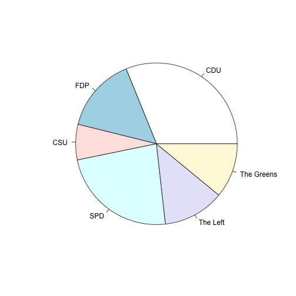

Welcome to Burlington UserR!
========================================================

Make a [doughnut plot](http://www.r-bloggers.com/doughnut-chart-in-r-with-googlevis/)


```r
dat <- data.frame(party = c("CDU", "FDP", "CSU", "SPD", "The Left", "The Greens"), 
    members.of.parliament = c(193, 93, 44, 146, 76, 68))
```


Make a pie plot

 


Make a snazzy Google plot


```r
library(googleVis)
```

```
## Welcome to googleVis version 0.4.5
## 
## Please read the Google API Terms of Use before you use the package:
## https://developers.google.com/terms/
## 
## Type ?googleVis to access the overall documentation and
## vignette('googleVis') for the package vignette. You can execute a demo of
## the package via: demo(googleVis)
## 
## More information is available on the googleVis project web-site:
## http://code.google.com/p/google-motion-charts-with-r/
## 
## Contact: <rvisualisation@gmail.com>
## 
## To suppress the this message use:
## suppressPackageStartupMessages(library(googleVis))
```

```r
## Doughnut chart - a pie with a hole
doughnut <- gvisPieChart(dat, options = list(width = 500, height = 500, slices = "{0: {offset: 0.2},\n1: {offset: 0.2},\n2: {offset: 0.2}}", 
    title = "German parliament 2009 - 2013\n(Goverment: CDU/FDP/CSU)", legend = "none", 
    colors = "['black','orange', 'blue',\n'red', 'purple', 'green']", pieSliceText = "label", 
    pieHole = 0.5), chartid = "doughnut")
plot(doughnut)
```

```
## starting httpd help server ...
```

```
## done
```


Here is some code 
